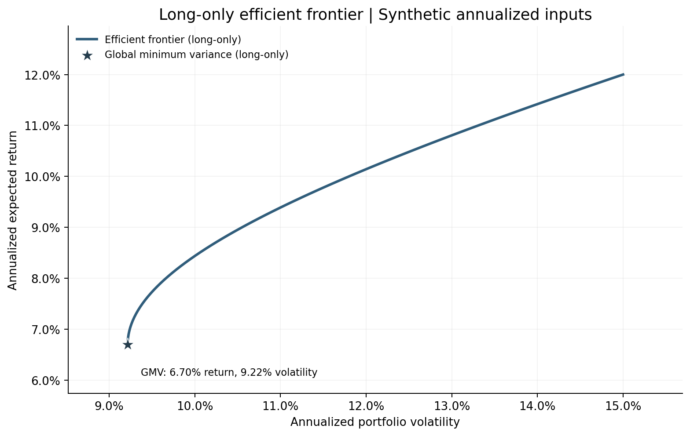
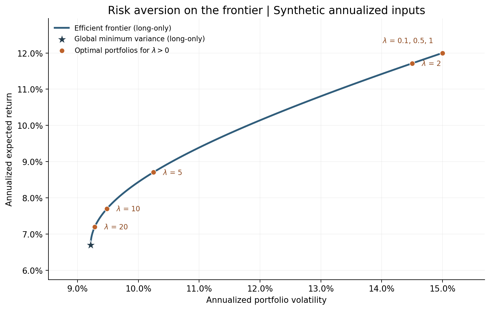

## Markowitz Portfolio Optimization

A Python implementation of Markowitz mean-variance portfolio optimization, including constrained quadratic programming, efficient frontier construction, and risk-aversion analysis.

## Overview

This undergraduate quantitative finance project connects the analytical GMV solution
with numerical convex optimization, active constraints, KKT conditions, and investor
preferences. The notebook is a short research note; reusable functions live in `src/`.

All experiments use the same **synthetic / illustrative annualized inputs**.
These are assumed moments, not historical market data, forecasts, or realized returns.

| Asset | Expected annual return | Annual volatility |
|---|---:|---:|
| Asset A | 8% | 20% |
| Asset B | 5% | 10% |
| Asset C | 12% | 15% |

$$
\mu=\begin{bmatrix}0.08\\0.05\\0.12\end{bmatrix},\qquad
\Sigma=\begin{bmatrix}
0.04 & 0.006 & 0.012\\
0.006 & 0.01 & 0.004\\
0.012 & 0.004 & 0.0225
\end{bmatrix}.
$$

Returns and volatility use decimals in code and CSV files; variance uses
squared-return units. The inputs are already annualized.

## Mathematical Formulation

For weights $w$, expected returns $\mu$, and covariance matrix $\Sigma$:

$$
\mathbb{E}[R_p]=\mu^\top w,\qquad
\sigma_p^2=w^\top\Sigma w,\qquad
\sigma_p=\sqrt{w^\top\Sigma w}.
$$

The off-diagonal terms of $\Sigma$ capture cross-asset covariance and therefore
diversification benefits. A positive-semidefinite $\Sigma$ makes variance convex;
the supplied positive-definite matrix gives unique optimal weights.

**Budget-only global minimum variance** (short selling allowed):

$$
\min_w w^\top\Sigma w
\quad\text{s.t.}\quad\mathbf{1}^\top w=1,
\qquad
w_{\mathrm{GMV}}=
\frac{\Sigma^{-1}\mathbf{1}}{\mathbf{1}^\top\Sigma^{-1}\mathbf{1}}.
$$

The analytical formula requires positive-definite $\Sigma$. It is implemented
using `np.linalg.solve`. “Unconstrained” here means no constraints beyond full
investment. Adding $w\geq0$ gives the **long-only GMV** problem.

**Minimum expected return**:

$$
\begin{aligned}
\min_w\quad &w^\top\Sigma w\\
\text{s.t.}\quad &\mathbf{1}^\top w=1,\quad w\geq0,\quad
\mu^\top w\geq R_{\mathrm{target}}.
\end{aligned}
$$

**Risk aversion**:

$$
\begin{aligned}
\max_w\quad &\mu^\top w-\lambda w^\top\Sigma w\\
\text{s.t.}\quad &\mathbf{1}^\top w=1,\quad w\geq0,\quad\lambda>0.
\end{aligned}
$$

This last experiment has no return floor and no $1/2$ in the variance penalty.
Lambda is a preference parameter; its scale depends on the units and horizon.
The notebook derives GMV stationarity and explains all four KKT conditions,
including why complementary slackness does **not** force every solution to a boundary.

## Project Structure

```text
markowitz-portfolio-optimization/
├── README.md
├── requirements.txt
├── .gitignore
├── notebooks/
│   └── markowitz_portfolio_optimization.ipynb
├── src/
│   ├── __init__.py
│   └── portfolio_optimization.py
├── figures/
│   ├── efficient_frontier.png
│   └── risk_aversion_on_frontier.png
├── results/
│   ├── portfolio_summary.csv
│   └── lambda_sensitivity.csv
├── tests/
│   └── test_portfolio_optimization.py
└── run_analysis.py
```

The single test file checks numerical correctness without another test dependency.
Generated figures, CSV files, and the executed notebook are included for direct review.

## Experiments

1. **Unconstrained GMV:** compare the analytical formula with the identical CVXPY problem.
2. **Long-only GMV:** assess whether the no-short-sale constraints change the optimum.
3. **Target-return optimization:** require at least 8% expected annual return.
4. **Efficient frontier:** solve 80 feasible target problems from long-only GMV toward 12%.
5. **Risk aversion:** solve for $\lambda\in\{0.1,0.5,1,2,5,10,20\}$.

## Key Results

The following values come from an actual run of `python run_analysis.py` and
`results/portfolio_summary.csv`. Displayed percentages are rounded.

| Portfolio | A weight | B weight | C weight | Expected return | Variance | Volatility |
|---|---:|---:|---:|---:|---:|---:|
| GMV (analytical) | 3.3037% | 73.8247% | 22.8717% | 6.7001% | 0.00849555 | 9.2171% |
| GMV (CVXPY, shorting allowed) | 3.3037% | 73.8247% | 22.8717% | 6.7001% | 0.00849555 | 9.2171% |
| GMV (CVXPY, long-only) | 3.3037% | 73.8246% | 22.8717% | 6.7001% | 0.00849555 | 9.2171% |
| Target return >= 8% (long-only) | 2.4390% | 55.7491% | 41.8118% | 8.0000% | 0.00933798 | 9.6633% |

- Analytical and CVXPY GMV weights agree; their maximum absolute difference was
  **5.13e-14** in the verified run.
- All original GMV weights are strictly positive, so the long-only inequalities
  are inactive. The constrained and budget-only optima agree within solver tolerance.
- The 8% return floor binds and raises volatility from about 9.22% to 9.66%.
  A lower 5% floor leaves the GMV portfolio unchanged, as demonstrated in the notebook.
- The long-only return cannot exceed the highest asset mean, 12%. Higher floors
  are rejected as infeasible.
- Asset A is dominated by C as a standalone holding, but still receives positive
  weight in GMV: covariance can make it useful in a diversified portfolio.

## Efficient Frontier



The plotted frontier starts at the **long-only GMV** portfolio and ends at the
maximum-return portfolio. Targets below GMV are omitted because they can simply
return GMV again. The vertical axis shows achieved expected return.

A dominated portfolio has an alternative with no higher risk and no lower return,
with at least one strict improvement. The efficient frontier summarizes the minimum
risk required for a target return under these inputs and constraints.

## Risk Aversion



| Lambda | Expected return | Variance | Volatility |
|---:|---:|---:|---:|
| 0.1 | 12.0000% | 0.02250000 | 15.0000% |
| 0.5 | 12.0000% | 0.02250000 | 15.0000% |
| 1 | 12.0000% | 0.02250000 | 15.0000% |
| 2 | 11.7143% | 0.02103061 | 14.5019% |
| 5 | 8.7058% | 0.01050127 | 10.2476% |
| 10 | 7.7030% | 0.00899698 | 9.4852% |
| 20 | 7.2016% | 0.00862091 | 9.2849% |

Larger lambda weakly reduces variance and expected return, moving toward GMV.
The three smallest values select essentially 100% Asset C and overlap on the chart;
their labels are grouped. These repeated corner solutions are valid.
The complete asset weights are in `results/lambda_sensitivity.csv`.

## Installation

Use **Python 3.10 or newer**. From a terminal:

```bash
git clone https://github.com/YOUR_USERNAME/markowitz-portfolio-optimization.git
cd markowitz-portfolio-optimization
python -m venv .venv
```

Activate the virtual environment:

```bash
# macOS / Linux
source .venv/bin/activate

# Windows PowerShell
.venv\Scripts\Activate.ps1
```

Then install the dependencies:

```bash
python -m pip install -r requirements.txt
```

CVXPY supplies CLARABEL, the open-source solver explicitly used by this project.
No API keys or market-data downloads are needed.

## Usage

Run all five experiments from the project root:

```bash
python run_analysis.py
```

The script prints concise results, creates `results/` and `figures/` if needed,
and overwrites the two CSV tables and two PNG figures with reproducible outputs.
Output locations are resolved relative to the script, not the shell's working directory.

Open the research notebook and choose **Restart Kernel and Run All Cells**:

```bash
jupyter notebook notebooks/markowitz_portfolio_optimization.ipynb
```

If the `jupyter` executable is not on your PATH, use the same Python interpreter:

```bash
python -m notebook notebooks/markowitz_portfolio_optimization.ipynb
```

The notebook loads the same data and optimization functions, regenerates the same
figures and CSV files, and requires no manual Python-path changes.

Run the numerical regression checks:

```bash
python -m unittest discover -s tests -v
```

The 12 checks cover covariance validity, analytical/numerical agreement, active and
inactive constraints, KKT residuals, hand-solved two-asset problems, feasible frontier
points, lambda comparative statics, and invalid or infeasible inputs.
Weights are checked within $10^{-8}$ of feasibility; a return floor is binding
within $10^{-7}$. Raw weights are not clipped or renormalized, so a tiny negative
number in a CSV may be a floating-point residual. Unexpected solver status raises
an error before any missing weights are accessed; failed points are never saved.

Verified with Python 3.12.13, NumPy 2.3.5, Pandas 2.2.3,
Matplotlib 3.10.8, CVXPY 1.9.2, CLARABEL 0.11.1,
and Jupyter 1.1.1. The script and regression checks ran successfully, with warnings
treated as errors in the final verification. All eight notebook code cells were
executed through an in-process IPython kernel because this verification environment
restricts Jupyter socket communication. Its two CSV files and two figures matched
the script outputs byte for byte. Standard browser-based Jupyter startup was not
verified in this environment. Dependency bounds are intentionally broad; this is
not a bit-for-bit environment lock.

## Tech Stack

Python, NumPy, Pandas, CVXPY (CLARABEL), Matplotlib, and Jupyter.
Implementation references: [CVXPY quadratic programming](https://www.cvxpy.org/examples/basic/quadratic_program.html)
and [solver documentation](https://www.cvxpy.org/tutorial/solvers/index.html).

## Limitations

- Expected returns and covariance are assumed known and fixed.
- Synthetic inputs exclude estimation error and parameter uncertainty.
- There are no transaction costs or dynamic rebalancing.
- The project evaluates a single allocation decision, not realized investment performance.
- The analytical formula and frontier sampler require positive-definite covariance.
  Individual numerical solvers accept positive-semidefinite inputs, but singular
  covariance can give nonunique GMV weights. The frontier sampler rejects this case
  because it would require an additional return tie-break to avoid dominated points.

## Future Work

- Real ETF data
- Rolling out-of-sample backtesting
- Transaction costs
- CVaR
- Robust optimization

These extensions are not implemented.

